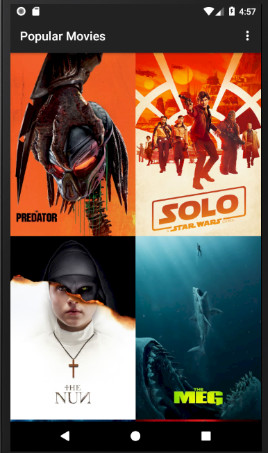
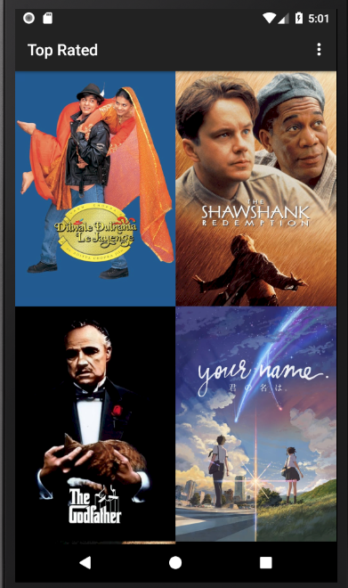
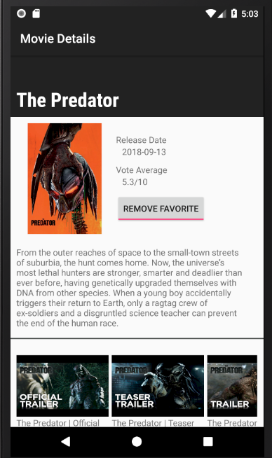
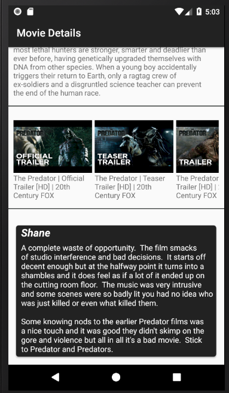
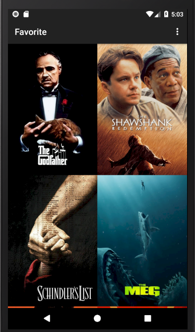

# Popular Movies

Most of us can relate to kicking back on the couch and enjoying a movie with friends and family. In this project, you’ll build an app to allow users to discover the most popular movies playing.

## Getting Started

Present the user with a grid arrangement of movie posters upon launch.
Allow user to change sort order via a setting:
* The sort order can be by most popular or by highest-rated
* Allow user to tap on a movie poster and transition to a details screen with additional information such as:
** original title
** movie poster image thumbnail
** A plot synopsis 
** user rating 
** release date
* allow users to view and play trailers ( either in the youtube app or a web browser).
* allow users to read reviews of a selected movie.
* allow users to mark a movie as a favorite in the details view by tapping a button(add favorite).







### Prerequisites

To fetch popular movies, you will use the API from themoviedb.org.

If you don’t already have an account, you will need to [create one](https://www.themoviedb.org/account/signup/) in order to request an API Key.

In your request for a key, state that your usage will be for educational/non-commercial use. You will also need to provide some personal information to complete the request. Once you submit your request, you should receive your key via email shortly after.

### Installing

Once you obtain your key, find class ApiKey.java and replace text with your APIKEY

```
 String API_KEY = "put your key here";
```


